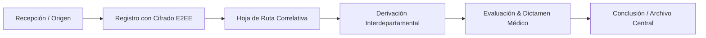
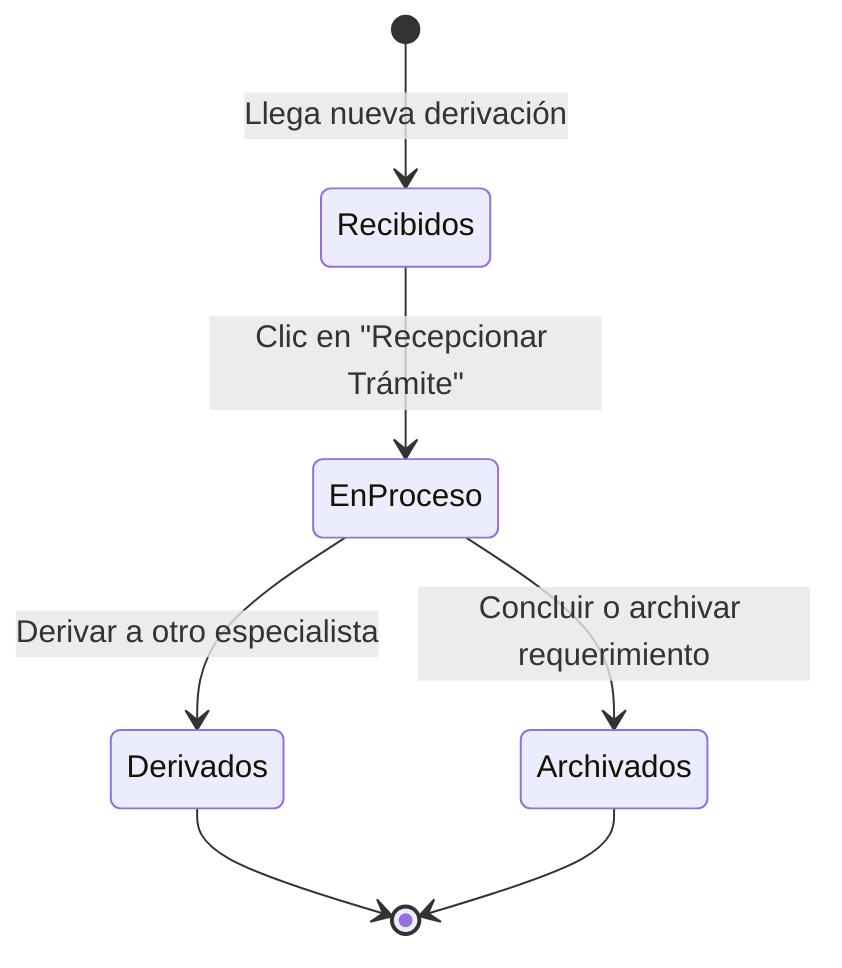
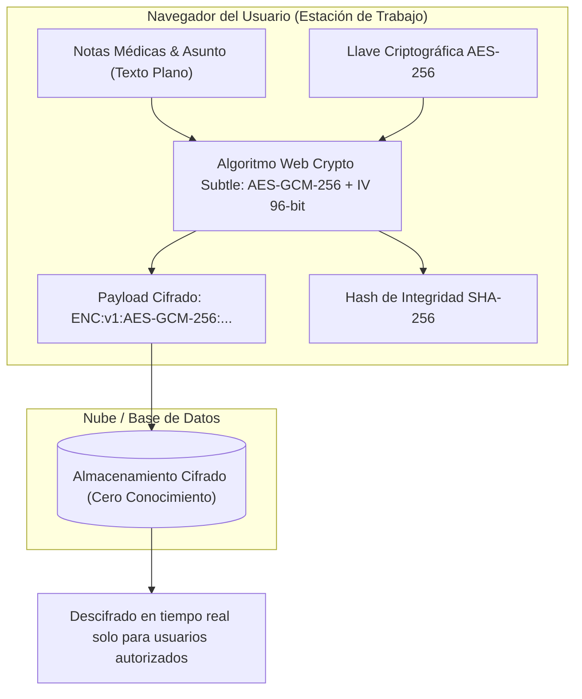
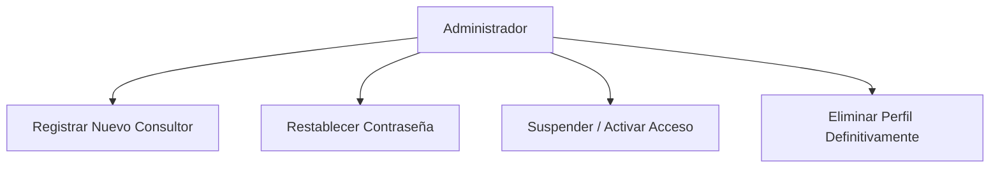

# MANUAL DE USUARIO OFICIAL - SISTEMA SOFTCOM
**Plataforma Integral de Correspondencia, Trazabilidad Documental & Consultoría en Salud**  
**SnowPoint Healthcare | Versión 2.5 - Edición 2026**

---

## ÍNDICE DE CONTENIDOS
1. [Introducción & Propósito del Sistema](#1-introducción--propósito-del-sistema)
2. [Estructura Organizacional & Roles (MOF MAN-002)](#2-estructura-organizacional--roles-mof-man-002)
3. [Acceso & Autenticación Segura](#3-acceso--autenticación-segura)
4. [Módulo de Bandejas de Correspondencia](#4-módulo-de-bandejas-de-correspondencia)
5. [Registro de Nuevos Trámites / Expedientes](#5-registro-de-nuevos-trámites--expedientes)
6. [Cifrado de Extremo a Extremo (E2EE) & Seguridad Criptográfica](#6-cifrado-de-extremo-a-extremo-e2ee--seguridad-criptográfica)
7. [Gestión del Flujo: Recepción, Derivación y Cierre](#7-gestión-del-flujo-recepción-derivación-y-cierre)
8. [Gestión de Documentos Adjuntos & Firma Digital Médica](#8-gestión-de-documentos-adjuntos--firma-digital-médica)
9. [Administración de Personal & Consultores](#9-administración-de-personal--consultores)
10. [Dashboard de Métricas & Reportes Oficiales en PDF](#10-dashboard-de-métricas--reportes-oficiales-en-pdf)
11. [Preguntas Frecuentes & Buenas Prácticas](#11-preguntas-frecuentes--buenas-prácticas)

---

## 1. INTRODUCCIÓN & PROPÓSITO DEL SISTEMA

**SoftCom** es la plataforma corporativa de gestión documental, correspondencia clínica y trazabilidad de proyectos diseñada para **SnowPoint Healthcare**. 

### Objetivos Principales:
* **Trazabilidad Absoluta:** Seguimiento en tiempo real de cada requerimiento, auditoría médica, proyecto o interconsulta desde su ingreso hasta su conclusión.
* **Seguridad y Confidencialidad de Grado Médico:** Protección de la información de pacientes y clientes mediante Cifrado de Extremo a Extremo (**AES-GCM de 256 bits**) y hashes de integridad **SHA-256**.
* **Estandarización Operativa:** Cumplimiento de la estructura funcional del Manual de Organización y Funciones (**MOF MAN-002 Rev 2.0**).
* **Cero Papel & Eficiencia:** Digitalización de proveídos, firmas y hojas de ruta descargables en PDF oficial.



---

## 2. ESTRUCTURA ORGANIZACIONAL & ROLES (MOF MAN-002)

El sistema segmenta los permisos y flujos de acuerdo a los roles oficiales de la organización:

| Rol en el Sistema | Código de Puesto | Descripción y Atribuciones |
| :--- | :--- | :--- |
| **Director General Ejecutivo (CEO)** | `DIR-EXE-001` | Máxima autoridad ejecutiva. Visualización transversal de todas las áreas, emisión de directrices ejecutivas y aprobación final. |
| **Jefe de Unidad Operativa** | `JEF-DIG / CAL / EPI / ACA` | Líderes de áreas clave (Salud Digital, Calidad y Auditoría, Epidemiología, Educación Médica). Asignan y derivan expedientes dentro de sus unidades. |
| **Consultor Sénior / Auditor** | `CON-SR-001` | Emisión de dictámenes técnicos, auditorías de historias clínicas y redacción de informes médicos especializados. |
| **Consultor Asociado / Analista** | `CON-AS-001` | Procesamiento de datos biomédicos, apoyo analítico y elaboración de entregables. |
| **Gestión Documental & Archivo** | `DOC-REC-001` | Recepción de correspondencia externa (hospitales, seguros, proveedores), digitalización y emisión inicial de Hojas de Ruta. |
| **Administrador General (Admin)** | `ADM-SIS-001` | Gestión de cuentas de usuario, asignación de áreas, auditoría de seguridad y soporte técnico de la plataforma. |

---

## 3. ACCESO & AUTENTICACIÓN SEGURA

1. **Ingreso a la Plataforma:** Ingrese a la URL institucional de SoftCom (`https://softcom-correspondencia.vercel.app`).
2. **Formulario de Identificación:**
   * Ingrese su **Nombre de Usuario** asignado (ej. `admin`, `dmedica`, `auditor.medico`).
   * Ingrese su **Contraseña personal**.
3. **Inicio de Sesión:** Haga clic en el botón **Ingresar al Sistema**.
4. **Cierre de Sesión:** Para proteger su cuenta, al culminar su jornada haga clic en el botón **Cerrar Sesión** ubicado en la esquina superior derecha o en la barra lateral.

> [!IMPORTANT]
> Por políticas de seguridad de la información médica, el sistema no almacena contraseñas en texto plano y ha deshabilitado accesos rápidos sin credenciales. Nunca comparta su contraseña con terceros.

---

## 4. MÓDULO DE BANDEJAS DE CORRESPONDENCIA

La pantalla principal de **Bandejas** organiza el trabajo del consultor en cuatro secciones intuitivas:



### 1. Bandeja de Recibidos (Por Aceptar)
* Contiene los documentos y trámites que han sido derivados a su persona o unidad y que **aún no han sido recepcionados formalmente**.
* **Acción requerida:** Hacer clic en el botón **Recepcionar** (<kbd>✓</kbd>) para confirmar la recepción física/digital del expediente y habilitar las acciones de respuesta.

### 2. Bandeja En Proceso (En Trámite)
* Expedientes bajo su custodia activa en los cuales está trabajando (redactando dictámenes, evaluando antecedentes o preparando informes).
* Desde esta bandeja puede hacer clic en cualquier fila para ingresar al **Detalle del Expediente**.

### 3. Bandeja de Derivados (Enviados)
* Muestra el historial de documentos que usted ha remitido a otros consultores o jefes de área, permitiendo verificar si el destinatario ya los recepcionó o si siguen pendientes de aceptación.

### 4. Bandeja de Archivados / Concluidos
* Repositorio histórico de trámites concluidos satisfactoriamente o archivados para consulta permanente.

---

## 5. REGISTRO DE NUEVOS TRÁMITES / EXPEDIENTES

Para ingresar un nuevo requerimiento, auditoría o correspondencia al sistema:

1. Diríjase a la opción **Nuevo Trámite** en el menú superior o lateral.
2. **Seleccione el Tipo de Correspondencia:**
   * **Interna:** Trámite originado por un médico, consultor o unidad interna de SnowPoint Healthcare.
   * **Externa:** Trámite proveniente de un cliente externo (Clínica, Hospital, Aseguradora, Laboratorio, Proveedor).
3. **Complete los Campos Requeridos:**
   * **Asunto / Motivo del Trámite (\*):** Resumen claro del objetivo del requerimiento (ej. *Auditoría de Historia Clínica Paciente HC-4491*).
   * **Prioridad:** Seleccione entre **Baja**, **Media** o **Alta (Urgencia Médica / Quirúrgica)**.
   * **Datos del Remitente (para correspondencia externa):** Nombre, Cargo, Institución de procedencia y CITE o Número de Referencia externo.
4. **Asignación & Destinatario Inicial:**
   * Seleccione a qué consultor o área se deriva de inmediato el expediente, o elija *Guardar en mi bandeja de Pendientes*.
   * Redacte la **Instrucción / Proveído inicial** (ej. *Para su revisión de pertinencia médica y emisión de dictamen pericial*).
5. **Adjuntar Documentos:**
   * Arrastre o seleccione hasta 5 archivos digitales (PDF, Word, Excel, Imágenes).
6. **Guardar Expediente:** Haga clic en **Registrar Expediente**. El sistema generará automáticamente el número de Hoja de Ruta correlativo único (ej. `HR-INT-2026-00001` o `HR-EXT-2026-00001`).

---

## 6. CIFRADO DE EXTREMO A EXTREMO (E2EE) & SEGURIDAD CRIPTOGRÁFICA

SoftCom incluye un protocolo de seguridad criptográfica de grado militar para la protección de secretos médicos e información confidencial de salud:



### Características del Cifrado E2EE:
* **Algoritmo:** **AES-GCM (Galois/Counter Mode) de 256 bits**, con vectores de inicialización aleatorios por cada operación.
* **Integridad Criptográfica:** Cálculo automático del Hash **SHA-256** para validar que el documento no ha sufrido alteraciones.
* **Distintivos Visuales:**
  * En **Bandejas**: Los expedientes protegidos muestran la insignia verde `[🔒 E2EE]`.
  * En el **Detalle**: Se presenta la tarjeta de **Certificado de Seguridad Criptográfica** con el Hash SHA-256 y la confirmación de integridad.

---

## 7. GESTIÓN DEL FLUJO: RECEPCIÓN, DERIVACIÓN Y CIERRE

Al abrir un expediente desde la bandeja de trabajo, el usuario custodio cuenta con las siguientes acciones:

```
[EXPEDIENTE: HR-INT-2026-00001]
 ├── 1. Recepcionar Trámite (Habilita la custodia formal)
 ├── 2. Derivar (Transfiere la custodia a otro especialista con nueva instrucción)
 ├── 3. Archivar (Envía al repositorio de archivo pasivo)
 └── 4. Concluir (Finaliza el trámite con resolución favorable o dictamen emitido)
```

### Paso a Paso para Derivar un Documento:
1. Abra el expediente en el **Detalle de Correspondencia**.
2. Si aún no lo ha recepcionado, presione el botón verde **Recepcionar Trámite**.
3. Haga clic en el botón azul **Derivar** (<kbd>Send</kbd>).
4. Seleccione el **Destinatario** (nombre del consultor y unidad).
5. Escriba el **Proveído / Instrucción Médica** (este texto se cifra automáticamente si el expediente es E2EE).
6. Presione **Confirmar Derivación**. El expediente pasará inmediatamente a la bandeja de *Recibidos* del nuevo destinatario y a su bandeja de *Derivados*.

---

## 8. GESTIÓN DE DOCUMENTOS ADJUNTOS & FIRMA DIGITAL MÉDICA

* **Descarga Segura:** En la barra lateral derecha del expediente encontrará la lista de archivos adjuntos. Haga clic en el icono de descarga (<kbd>Download</kbd>) para obtener el archivo original.
* **Verificación de Firma Digital:**
  * Si el archivo es un documento PDF firmado digitalmente, el sistema mostrará un sello verde **Firmado Digitalmente**.
  * Al hacer clic sobre el sello, podrá consultar los detalles del certificado del firmante, la fecha y el estado de validez de la firma.

---

## 9. ADMINISTRACIÓN DE PERSONAL & CONSULTORES

> [!NOTE]
> Módulo de acceso exclusivo para usuarios con rol **Administrador General (`ADMIN`)**.

Ubicado en el menú principal bajo **Gestión de Personal**, este módulo permite:



### 1. Registrar Nuevo Consultor / Staff:
1. Haga clic en el botón **+ Nuevo Consultor**.
2. Ingrese Nombre Completo, Cargo oficial (según MOF), Unidad de adscripción, Nombre de Usuario, Correo institucional, Contraseña temporal y Rol del Sistema.
3. Haga clic en **Guardar y Activar Consultor**.

### 2. Restablecer Contraseña de un Usuario:
1. Ubique al usuario en la tabla y presione el botón **Clave** (<kbd>KeyRound</kbd>).
2. Ingrese la nueva clave de acceso y presione **Actualizar Contraseña**.

### 3. Suspender o Reactivar Acceso:
* Presione el botón **Suspender** para deshabilitar temporalmente el inicio de sesión de un consultor sin borrar su historial ni sus derivaciones pasadas.

### 4. Borrar Perfil de Usuario:
* Presione el botón rojo **Borrar** (<kbd>Trash2</kbd>).
* Revise la ventana modal de advertencia y presione **Eliminar Definitivamente**.
* *Nota de Seguridad:* La cuenta principal `admin` no puede ser eliminada bajo ninguna circunstancia para garantizar la operatividad permanente del sistema.

---

## 10. DASHBOARD DE MÉTRICAS & REPORTES OFICIALES EN PDF

### Panel de Control (Dashboard):
* **Tarjetas de Resumen:** Visualice en tiempo real el número de expedientes registrados, trámites internos vs. externos, pendientes, en proceso y concluidos.
* **Gráfica de Flujo Mensual:** Indicador comparativo de expedientes ingresados vs. derivados por mes.
* **Actividad por Unidad:** Número de trámites activos asignados al área del usuario conectado.

### Generación e Impresión de Hoja de Ruta en PDF:
1. Ingrese al detalle de cualquier expediente.
2. En la parte superior derecha, presione el botón **Imprimir Hoja de Ruta (PDF)**.
3. Se generará un documento formal membretado con el logotipo oficial de **SnowPoint Healthcare**, datos del expediente, código CITE, historial completo de derivaciones con fechas exactas y pie de página de trazabilidad y auditoría.

---

## 11. PREGUNTAS FRECUENTES & BUENAS PRÁCTICAS

### ¿Qué debo hacer si me derivan un trámite por error?
* Ingrese a la bandeja de *Recibidos*, recepcione el documento y derívelo inmediatamente al área correcta indicando en el proveído: *"Derivado por pertinencia de área al especialista correspondiente"*.

### ¿Cómo identifico un trámite urgente?
* Los trámites marcados como urgencia médica o prioridad alta aparecen destacados con una etiqueta roja brillante **URGENCIA MÉDICA**, tanto en bandejas como en el detalle del expediente.

### ¿Puedo editar un proveído una vez enviado?
* Por principios de inmutabilidad y auditoría legal en salud, una vez que una derivación ha sido remitida no puede modificarse. Puede enviar una nueva derivación aclaratoria si fuera necesario.

### ¿Dónde solicito soporte técnico o creación de nuevas áreas hospitalarias?
* Póngase en contacto con la Dirección de Sistemas e Infraestructura Tecnológica a través de la cuenta de Administración General de SnowPoint Healthcare.

---
**SnowPoint Healthcare © 2026 - Todos los derechos reservados.**  
*Documento de Propiedad Intelectual y Uso Exclusivo Institucional.*
